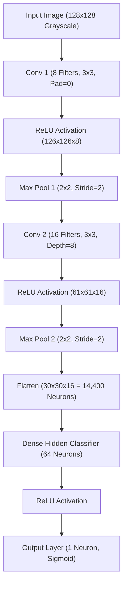

# Perceptronium CNN: Zero-Library Convolutional Neural Network in Rust

**Perceptronium CNN** is a fully custom, high-performance Convolutional Neural Network (CNN) built **completely from scratch in Rust** with **zero external machine learning libraries** (no PyTorch, Candle, `ndarray`, or `tch-rs`).

It is designed for the standard Cat vs. Dog classification task on Microsoft’s Cats & Dogs dataset. By implementing convolve operations, 2D max-pooling with index tracking, flattening, fully connected layers, backpropagation, and SGD with momentum entirely in standard Rust, this sub-project offers complete mechanical transparency into how convolutional neural networks learn spatial hierarchies from raw pixels.

---

## 🏗️ Architectural Topology

The neural network is structured hierarchically to extract low-level edges, combine them into high-level geometric parts, and classify them using dense layers:



### 1. Mathematical Forward Pass

* **Input Image:** Standardized grayscale tensor $\mathbf{X}$ of dimension $128 \times 128$ pixels.
* **Conv Layer 1:** Convolves the single-channel input using $8$ filters of size $3 \times 3$ with stride $1$ and no padding:

$$
\mathbf{H}^{(1)}_{f} = \text{ReLU}\left(\mathbf{X} * \mathbf{K}^{(1)}_{f} + b^{(1)}_{f}\right) \quad \forall f \in [1, 8]
$$

This outputs $8$ feature maps of dimension $126 \times 126$.

* **Max Pooling 1:** Downscales the spatial resolution using a $2 \times 2$ window with stride $2$:

$$
\mathbf{P}^{(1)}_{f}(i,j) = \max \left( \mathbf{H}^{(1)}_{f}(2i:2i+2, \, 2j:2j+2) \right)
$$

Tracks and caches the exact argmax indices $(r, c)$ inside each pooling window to feed precise gradients backward. This outputs $8$ maps of dimension $63 \times 63$.

* **Conv Layer 2:** Convolves the 8-channel pooled feature maps using $16$ filters of dimension $3 \times 3 \times 8$:

$$
\mathbf{H}^{(2)}_{g} = \text{ReLU}\left( \sum_{f=1}^{8} \mathbf{P}^{(1)}_{f} * \mathbf{K}^{(2)}_{g, f} + b^{(2)}_{g} \right) \quad \forall g \in [1, 16]
$$

This outputs $16$ feature maps of dimension $61 \times 61$.

* **Max Pooling 2:** Downscales using another $2 \times 2$ window with stride $2$, outputting $16$ maps of size $30 \times 30$ ($14,400$ flattened elements).

* **Dense Hidden Layer:** Fully connected feedforward layer mapping the flattened spatial features ($14,400$) to $64$ hidden units:

$$
\mathbf{z}_d = \mathbf{W}_d \cdot \text{flatten}(\mathbf{P}^{(2)}) + \mathbf{b}_d
$$

$$
\mathbf{a}_d = \max(0, \, \mathbf{z}_d) \quad \text{(ReLU Activation)}
$$

* **Output Classification:** Projects the hidden neurons to a single probability output:

$$
z_o = \mathbf{w}_o \cdot \mathbf{a}_d + b_o
$$

$$
p = \sigma(z_o) = \frac{1}{1 + e^{-z_o}} \quad \text{(Cat/Dog Probability)}
$$

---

## 🧪 Backpropagation Mechanics

The backpropagation engine computes partial derivatives analytically using the chain rule, convolving gradients backward and mapping errors precisely onto the network weights:

1. **Loss Function (Binary Cross-Entropy):**

$$
\mathcal{L} = - [y \ln(p) + (1 - y) \ln(1 - p)]
$$

2. **Output Error ($\delta_o$):**

$$
\delta_o = \frac{\partial \mathcal{L}}{\partial z_o} = p - y
$$

3. **Dense Hidden Layer Error ($\boldsymbol{\delta}_d$):**

$$
\boldsymbol{\delta}_d = \left( \mathbf{w}_o \cdot \delta_o \right) \odot \text{ReLU}'(\mathbf{z}_d)
$$

$$
\text{where } \text{ReLU}'(x) = \begin{cases} 1 & \text{if } x > 0 \\ 0 & \text{if } x \le 0 \end{cases}
$$

4. **Flattened Feature Error ($\boldsymbol{\delta}_f$):**

$$
\boldsymbol{\delta}_f = \mathbf{W}_d^T \cdot \boldsymbol{\delta}_d
$$

5. **Conv Layer 2 Gradients:** Gradients are propagated back through the Max Pooling 2 layers by scattering values only to the stored argmax indices. The spatial gradient with respect to the Conv2 kernel is calculated using the convolved inputs:

$$
\frac{\partial \mathcal{L}}{\partial \mathbf{K}^{(2)}_{g, f}} = \mathbf{P}^{(1)}_{f} * \boldsymbol{\delta}^{(2)}_{g}
$$

6. **L2 Regularization (Weight Decay):** To mitigate overfitting, we apply L2 regularization ($\lambda = 0.001$) to the dense weights during SGD updates:

$$
\mathbf{W}_d \leftarrow \mathbf{W}_d - \eta \left( \frac{\partial \mathcal{L}}{\partial \mathbf{W}_d} + \lambda \mathbf{W}_d \right)
$$

---

## 📁 Codebase Organization

* **[src/math.rs](src/math.rs)**: Standard math primitives including Sigmoid/ReLU activations, BCE loss, vector/matrix multiplications, and our custom deterministic LCG pseudo-random generator.
* **[src/dataset.rs](src/dataset.rs)**: Disk scanner and preloader. Automatically scales and normalizes raw images into grayscale $128 \times 128$ arrays and provides terminal ASCII visualizations.
* **[src/nn.rs](src/nn.rs)**: Custom convolutional network state management. Caches activation buffers, handles the forward pass, and implements convolutional backpropagation.
* **[src/main.rs](src/main.rs)**: Program driver. Controls training hyperparameters, runs validation reviews, and manages the interactive playground CLI.

---

## 🚀 Installation & Usage

You need the standard Rust toolchain (Rustc and Cargo) to compile and run this project.

### 1. Run Unit Tests
Validate mathematical correcteness, Max Pooling indices caching, and convolution forward/backward mechanics:
```bash
cargo test
```

### 2. Train from Scratch
Train the CNN on the Cats & Dogs dataset. This runs completely on the CPU, showing full convergence outputs epoch by epoch:
```bash
cargo run --release -- --train   # or -t
```

### 3. Evaluate Saved Weights
Load the saved parameters from `weights.txt` and run an evaluation pass on the test dataset split:
```bash
cargo run --release -- --eval    # or -e
```

### 4. Interactive Playground
Run inference instantly on any local JPEG or PNG image using your learned weights:
```bash
cargo run --release -- --play    # or -p
```
*(Provide the path to any photo of your pet, watch the network generate a terminal ASCII art rendering, and predict the animal class instantly!)*

---

## 💾 Weight Serialization (`weights.txt`)

To ensure complete educational transparency, weights are saved in plain text format:
1. **Header Line:** Layer shapes (`FILTERS1,FILTERS2,DENSE_NEURONS,FLATTENED_SIZE`)
2. **Biases & Output Weights:** Raw float lists representing biases and dense-to-output parameters.
3. **Kernel Parameters:** Iterative listings of Conv1 (8 filters of size 3x3) and Conv2 (16 filters convolving 8 channels) parameters.
4. **Dense Weights:** Detailed floating-point vectors representing the dense projection indices.
