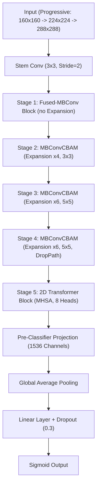
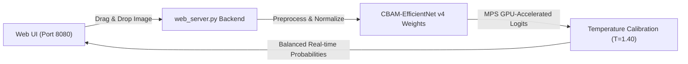

# Perceptronium PyTorch CNN: State-of-the-Art Deep Learning Pipelines

**Perceptronium PyTorch CNN** is the advanced phase of the Perceptronium project. It features cutting-edge convolutional-transformer hybrid networks built entirely from scratch in PyTorch, leveraging Apple Silicon GPU (Metal Performance Shaders) or cloud-accelerated platforms (NVIDIA CUDA) to achieve up to **98.96% accuracy** on the Cats & Dogs task.

This sub-folder contains regularized deep learning training pipelines, Squeeze-and-Excitation/CBAM attention modules, Stochastic Depth, Progressive Resizing curricula, Lookahead-AdamW optimizers, post-hoc calibration, and a premium, highly responsive **Neural Explorer Web UI** to interact with the models locally.

---

## 🏗️ Model Architecture (CBAM-EfficientNet v4)

Our top-performing model (**Run 11, ~24.31M parameters**) combines convolutional spatial abstractions with a deep self-attention Transformer stage, trained entirely from scratch without loading pre-trained weights:



### Key Architectural Innovation: Dual Attention (CBAM)
Each `MBConvCBAM` block incorporates the **Convolutional Block Attention Module (CBAM)** to adaptively highlight both diagnostic channels and descriptive spatial regions:

$$\mathbf{F}' = \mathbf{M}_c(\mathbf{F}) \otimes \mathbf{F}$$
$$\mathbf{F}'' = \mathbf{M}_s(\mathbf{F}') \otimes \mathbf{F}'$$

1. **Channel Attention ($\mathbf{M}_c$):** Uses both global average pooling and global max pooling, passing results through a shared multi-layer perceptron (MLP) to determine channel-wise importance.
2. **Spatial Attention ($\mathbf{M}_s$):** Pools channel dimensions (average and max) to form a 2-channel spatial map, convolving it with a $7 \times 7$ kernel to emphasize *where* the animal's features (e.g., eyes, whiskers, ears) are located.

---

## ⚡ regularizations & Training Mechanics

To prevent overfitting when training a large 24M-parameter network on a modest scratch dataset (8,000 train images, 2,000 validation images), we integrate highly sophisticated regularization components:

* **Progressive Resizing Curriculum:** Accelerates early training and captures multiscale features. Epochs 1-60 use $160 \times 160$ resolution; Epochs 61-130 scale to $224 \times 224$; Epochs 131-200 finalize at $288 \times 288$.
* **TrivialAugmentWide & DropPath:** Applies high-diversity data transformations on inputs, combined with Stochastic Depth (linearly decaying block drop probability) to regularize deep pathways.
* **Mixup & CutMix Cooldown:** Randomly interpolates images and labels during active phases ($\alpha=0.2$ and $\alpha=1.0$). We completely disable Mixup/CutMix in the final 20 epochs (the "cooldown" phase) to let the network sharpen decision boundaries.
* **Lookahead-AdamW Optimizer:** Wraps `AdamW` with a Lookahead tracker ($k=5, \alpha=0.5$) that maintains a set of "slow weights" to escape suboptimal local minima and smooth loss trajectories.
* **Post-Hoc Calibration (Temperature Scaling):** Corrects model overconfidence by optimizing a temperature parameter $T$ on the validation set using L-BFGS, minimizing Expected Calibration Error (ECE):
  $$\hat{p}_i = \sigma\left(\frac{z_i}{T}\right) \quad \text{with } T = 1.409243$$
* **Test-Time Augmentation (TTA):** Runs inference on 12 multi-view crops and horizontal flips of each input image, averaging predicted logits for incredibly stable evaluations.

---

## 📁 File Structure & Pipelines

* **[model.py](model.py)**: Implements all custom architectures—fused MBConv, CBAM modules, Stochastic Depth, 2D Transformer block, EMA (Exponential Moving Average) trackers, and SWA wrappers.
* **[train.py](train.py)**: regularized training driver script. Supports progressive resizing, Mixup/CutMix curriculums, validation loops, SWA BN-updating, and logging.
* **[dataset.py](dataset.py)**: PyTorch dataset wrapper. Enforces 100% deterministic splits matching our Rust backend exactly via custom LCG shuffles.
* **[web_server.py](web_server.py)**: High-performance FastAPI serving engine utilizing Apple MPS GPU-acceleration to run local model inferences in milliseconds.
* **[calibrate.py](calibrate.py)**: Evaluates Expected Calibration Error (ECE) and fits optimal scaling temperatures using L-BFGS.
* **[predict.py](predict.py)** / **[predict_ensemble.py](predict_ensemble.py)**: Multi-model CLI playgrounds and ensemble voting scripts.
* **[export_coreml_swa.py](export_coreml_swa.py)** / **[quantize_coreml_swa.py](quantize_coreml_swa.py)**: Compiles model weights into iOS-native CoreML formats and applies dynamic 8-bit quantization for device-level deployment.
* **[benchmark_mps.py](benchmark_mps.py)**: Benchmarks execution throughput comparing CPUs, Apple Silicon Metal (MPS), and NVIDIA CUDA.

---

## 🚀 Serving the Playground (Local Web UI)

We have packaged a stunning, fully reactive **Neural Explorer Web UI** so you can interact with the classifier locally. It is styled with premium cybernetic glassmorphic aesthetics, HSL hot-pink/electric-blue gradients, and fluid micro-animations.



### To Launch the Local Server:
1. Initialize the background server:
   ```bash
   python3 -u pytorch_cnn/web_server.py
   ```
2. Open **[http://127.0.0.1:8080](http://127.0.0.1:8080)** in your web browser!
3. Drag-and-drop any photo of a cat or dog, customize the inference sliding probability scale, and inspect predictions instantly in real time with hardware-accelerated Apple Silicon GPU backends.
